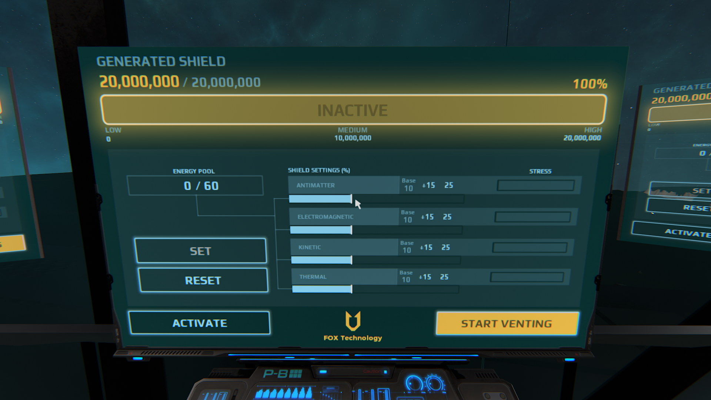
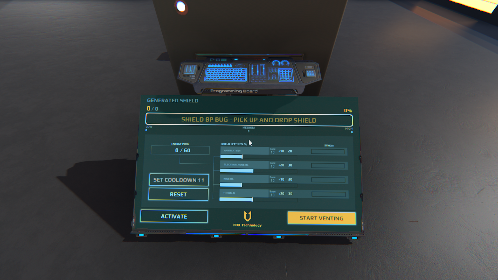

# Dual Universe - Shield Screens

*** UPDATE - Now works with the blueprint/shield bug, displaying a helpful hint :) ***

See a video of the interface in action (descriptions are in the subtitles/CC of the video): https://youtu.be/_1-vTFibuoo

This is a direct replication of the shield unit's control interface, placed on screens so it can be used from seats, at engineering stations etc.

Future Proof (uses the new screen RenderScript technology).
Each screen manages it's own energy pool, allowing for multiuser or as pool presets.

To install:
- Download and copy the .conf file from this repository.
- Paste to a programming board with at least one screen and a shield linked to it.

Contact: rob_rocketpants#9999 on discord
